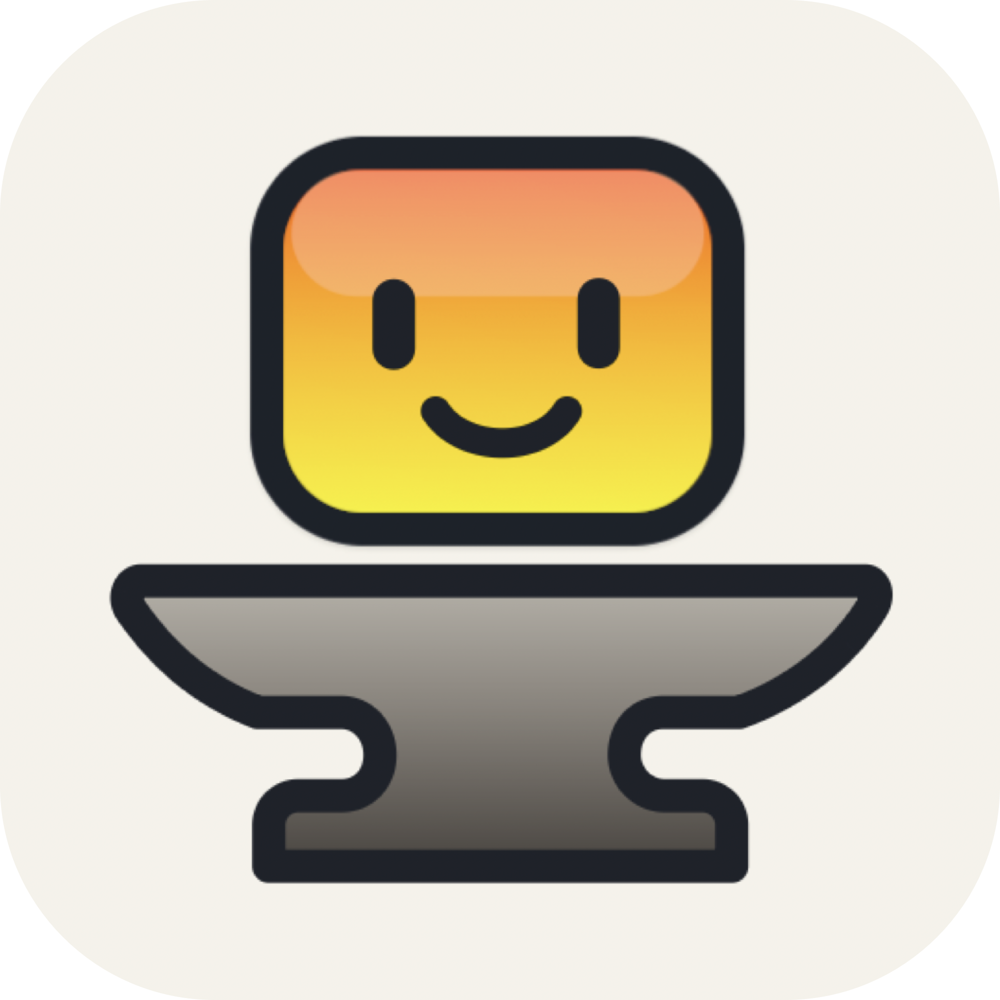
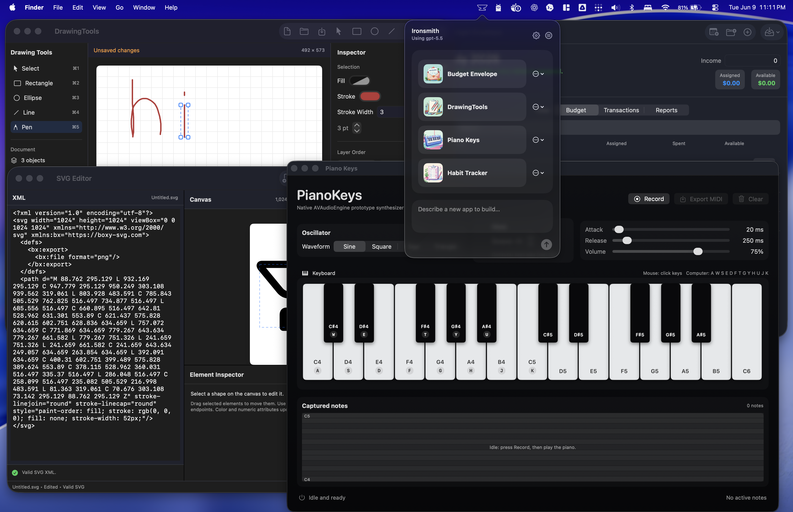
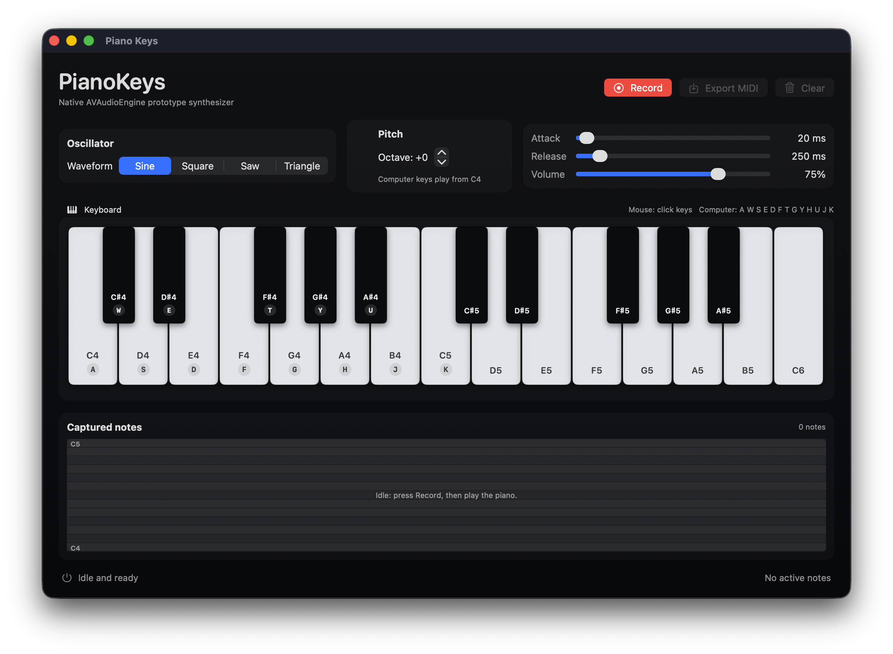
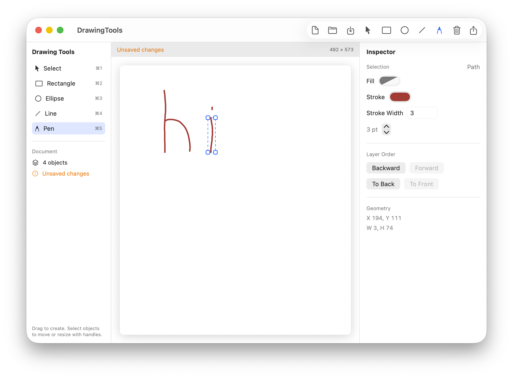
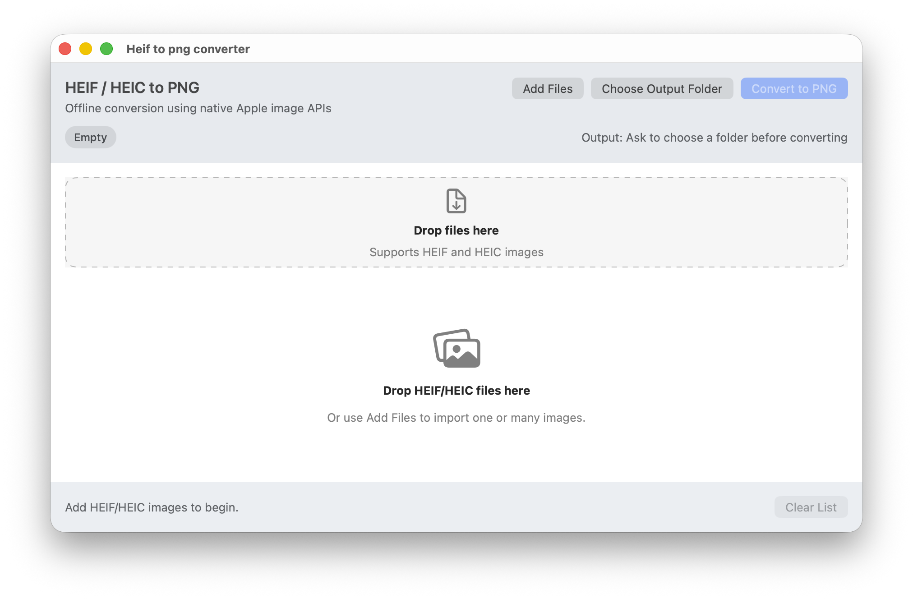
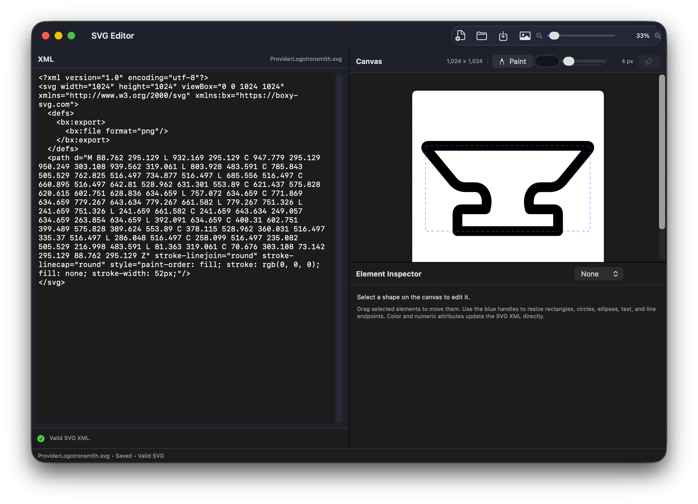
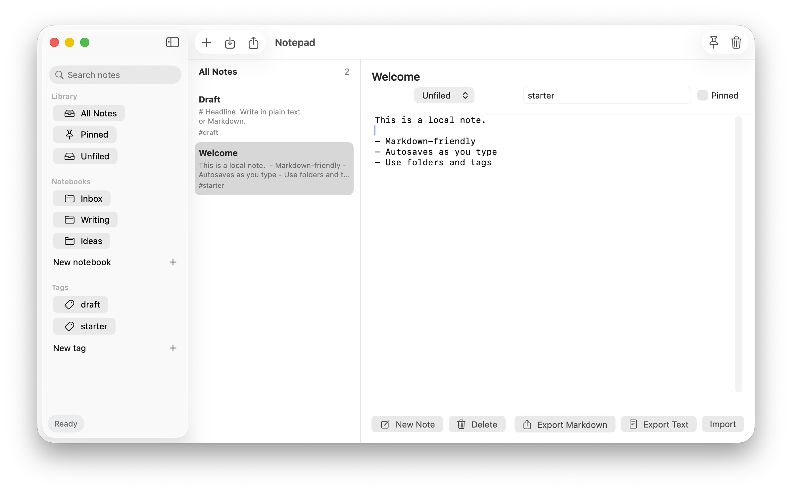
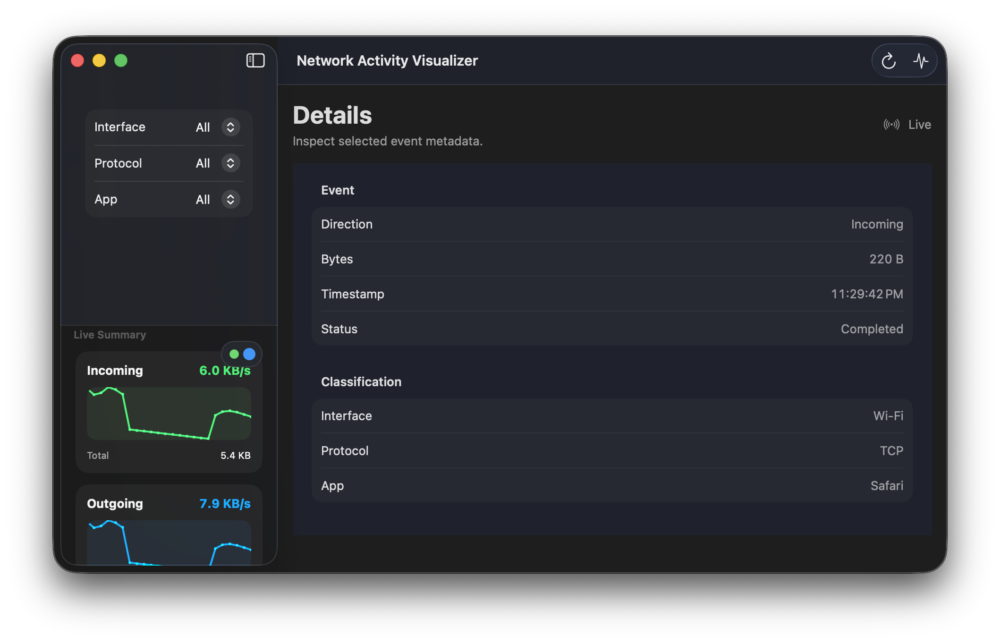

<p align="center">
  
</p>

<h1 align="center">Ironsmith</h1>

Ironsmith is a free, open-source macOS menu bar app for making small, personal Mac apps with AI. Describe what you want, and Ironsmith generates, builds, and saves a native SwiftUI app you can launch, edit, and export to your Applications folder.

<br>

<p align="center">
  
</p>

## What It Does

- **Builds real Mac apps.** Generated apps are Swift and SwiftUI apps, no Electron to be found.

- **Lives in your menu bar.** Makes it very convenient to create a new app, run saved apps, edit an existing app, restore a previous version, view the code, or export a finished app bundle.
- **Works with local AI.** Ironsmith was designed with local AI support in mind, and has Ollama support out of the box. You can also connect any OpenAI compatible API, so LM Studio and Llama.cpp work great too. You can even build very simple apps with Apple's built in Foundation Model.
- **Supports hosted models too.** Bring your own API keys for OpenAI, Anthropic, and Gemini, or skip the API key and sign into Ironsmith to access them immediately.
- **Doesn't require Xcode.** Every generated app is a Swift package and is built entirely with the lightweight Xcode command line tools rather than full Xcode. In fact Ironsmith itself doesn't even use Xcode!
- **Sandboxes every app by default.** Generated apps are built as signed app bundles with sandboxing and hardened runtime enabled, greatly reducing the impact of bugs, mistakes, or malicious behavior. Sensitive permissions such as camera and microphone access must also be explicitly enabled. However, you can disable these protections, and if you do, it’s highly recommended that you review the code before running it.

## Examples

Ironsmith works best for focused utilities: the small apps you wish existed but wouldn't want to hunt down or build yourself. That said, with more capable models like GPT‑5.5 or Opus 4.8, you can create some surprisingly sophisticated apps.

| Synthesizer | Painting App | HEIF Converter |
| --- | --- | --- |
|  |  |  |

| SVG Editor | Notepad | Network Visualizer |
| --- | --- | --- |
|  |  |  |

Some examples of prompts you can try:

- "Make a utility that renames a folder of screenshots by date and window title."
- "Build a tiny app that splits a PDF into one file per page."
- "Build a clipboard cleaner that strips tracking parameters from copied URLs."
- "Make a small CSV inspector that highlights duplicate rows and missing values."

## Install

Download the latest Ironsmith build from [GitHub Releases](https://github.com/Jeidoban/Ironsmith/releases/latest) or [the website](https://ironsmith.app).

Ironsmith requires macOS 26 or newer and supports both Intel and Apple Silicon Macs. Make sure Apple Intelligence is enabled where available; Ironsmith uses it to create app icons and provide the built-in Foundation Model.

On first launch, Ironsmith checks for the Xcode Command Line Tools as generated apps are compiled locally. If they are missing, macOS will prompt you to install them. You can also install them manually:

```sh
xcode-select --install
```

## Develop

Development requires macOS 26 or newer and the Xcode Command Line Tools. Xcode itself is not required.

Build the development app:

```sh
script/build.sh
```

Build and run the development app:

```sh
script/build.sh run
```

Run tests:

```sh
script/test.sh
```

Clean SwiftPM and script outputs:

```sh
script/clean.sh
```
Copy `Config/.env.example` to `Config/.env` and fill in `IRONSMITH_DEV_SIGN_IDENTITY` with your Apple Development ID to avoid repeated keychain asks when running new builds.

## Contribute

Issues and pull requests are welcome. Start with [CONTRIBUTING.md](CONTRIBUTING.md) for the local workflow and PR expectations.

## License

Ironsmith is licensed under the [GNU General Public License v3.0](LICENSE).
